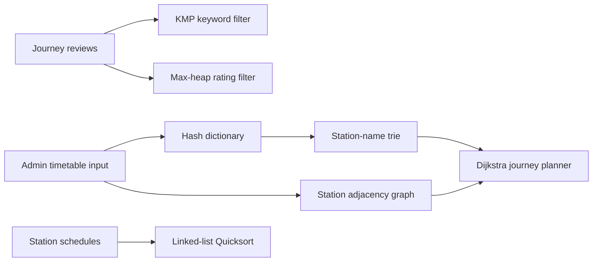

# Algorithmic Railway Search Planner


An in-memory railway journey and review search engine written in C++. The
project models a timetable as a directed graph, finds the shortest feasible
route with Dijkstra's algorithm, supports station autocomplete through a trie,
and provides review search and ranking workflows powered by KMP and a max-heap.

**Course project:** August–November 2022

**Core topics:** C++ · Dijkstra · KMP · Quicksort · Data structures

## What the planner supports

- Add and remove stations, journey codes, and complete train timetables.
- Search station names by one or more word prefixes.
- Find the shortest scheduled route subject to train-change and transfer-wait
  limits.
- Display station schedules ordered by weekday and departure time.
- Insert and delete journey reviews using stable, user-facing review IDs.
- Filter reviews by keyword or display ratings above a chosen threshold.
- Load menu commands interactively or from a text file.

## Algorithms and data structures

| Component | Implementation | Used for |
| --- | --- | --- |
| Dijkstra shortest path | `printJourney.cpp` | Timetable-aware journey search over feasible station/service states |
| KMP string matching | `kmp.cpp` | Linear-time keyword filtering within review text |
| Quicksort | `quicksort.cpp` | In-place ordering of linked schedule entries by day and departure time |
| Max-heap | `Heap.h`, `Heap.cpp` | Returning reviews at or above a rating threshold |
| Hash dictionary | `dictionary.h`, `dictionary.cpp` | Station-to-index lookup with linear probing and tombstones |
| Trie | `Trie.h`, `Trie.cpp` | Station prefix completion, insertion, and deletion |
| Directed graph | `dictionary.h`, `planner.cpp` | Adjacency lists for the railway network and train services |
| BST and AVL tree | `data_structures/` | Reusable ordered-set implementations with search, traversal, and deletion |
| Doubly linked list | `dictionary.h` | Schedules, connections, completions, and reviews |

The BST, AVL tree, and heap implementations are exercised by focused tests.
The graph, trie, dictionary, KMP, Quicksort, heap, and Dijkstra implementations
are integrated into the planner's interactive workflows.

## How the pieces fit together



## Build and run

### Requirements

- A C++17-compatible compiler (`g++`, `clang++`, or `c++`)
- GNU Make or a compatible `make` implementation
- macOS or Linux

### Build

```bash
git clone https://github.com/YuvrajS23/Railway-Planner.git
cd Railway-Planner
make
```

Start the interactive planner and write activity to `planner.log`:

```bash
./railway-planner planner.log
```

The same command is available as:

```bash
make run
```

The project uses the original coursework's single-translation-unit layout:
`main.cpp` includes the implementation modules. If building without Make,
compile `main.cpp` only—not every `.cpp` file:

```bash
c++ -std=c++17 -O2 -Wall -Wextra -pedantic main.cpp -o railway-planner
```

## Try the reproducible demo

```bash
make demo
```

The scripted session creates an `ALPHA → BETA → GAMMA` timetable, searches for
the shortest route, inserts and filters a review with KMP, deletes that review,
and prints a weekday-sorted station schedule. The route portion includes:

```text
Shortest railway route (Dijkstra):
  ALPHA
    -- journey 101, travel 1h 0m -->
  BETA
    -- journey 101, travel 0h 45m -->
  GAMMA
Total scheduled time: 1h 45m
Stop-overs (train changes): 0
```

## Using the CLI

At the first prompt, enter one of these access codes:

| Code | Mode |
| --- | --- |
| `1879` | Administrator: manage stations, routes, and timetable records |
| Any positive integer | User: plan journeys and manage/search reviews |
| `0` | Exit |

Useful administrator actions:

| Menu | Action |
| --- | --- |
| `1` | Add or delete a station |
| `2` | Add or delete a journey code |
| `3` | Read commands from a file |
| `5` | Print the station-name trie |
| `6` | Add a train's complete stop-by-stop timetable |

Useful user actions:

| Menu | Action |
| --- | --- |
| `110` | Insert or delete a review |
| `120` | Search reviews by KMP keyword, rating threshold, or no filter |
| `150` | Print the Quicksort-ordered schedule for a station |
| `160` | Plan a route with Dijkstra under transfer constraints |

Times use 24-hour `HHMM` integers—for example, `0915` for 09:15 and `1740`
for 17:40. The seven-digit service mask runs from Sunday through Saturday;
`1111100`, for example, enables the first five days in that sequence.

## Tests

Run the data-structure tests and the end-to-end planner smoke test:

```bash
make test
```

The test target covers heap ordering and underflow, BST operations, AVL
rotations/balance after insertion and deletion, plus the complete scripted CLI
workflow.

## Repository layout

```text
.
├── main.cpp                         # CLI entry point
├── planner.h / planner.cpp          # Menus and application workflows
├── printJourney.cpp                 # Dijkstra route planning
├── kmp.cpp                          # Review keyword search
├── quicksort.cpp                    # Schedule ordering
├── Heap.h / Heap.cpp                # Linked max-heap
├── Trie.h / Trie.cpp                # Station autocomplete
├── dictionary.h / dictionary.cpp    # Core models, lists, and hash table
├── data_structures/                 # BST and AVL tree templates
├── tests/                           # Focused structure tests
└── examples/demo-session.txt        # Reproducible CLI input
```

## Design notes and limitations

- All data is held in memory for the lifetime of one CLI session.
- The station dictionary has a fixed capacity of 512 entries.
- Route search uses recurring weekly timetable intervals rather than dated,
  real-world railway feeds.
- Malformed legacy time records remain searchable with a conservative positive
  edge fallback, but cannot provide precise transfer-wait calculations.
- This is an educational algorithmic planner, not a booking or production
  timetable system.

## Provenance

This project originated as an IIT Bombay CS293 data-structures and algorithms
coursework project from Autumn 2022. The Git history is retained from the
[source repository](https://github.com/Bishal-Sikdar/Railway-Planner), whose
original commit is authored by `YuvrajS23`. The source repository did not
declare an open-source license, so no license has been added here.
